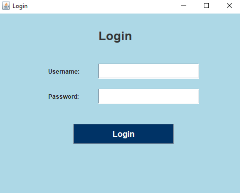

# Expense tracking system

This is a simple expense management application designed to help users manage their accounts, track expenses, and view dashboards for better financial planning. 
It features user authentication (signup, login, logout) and a clean, user-friendly interface.

## Features

- User registration and login/logout
- Dashboard overview
- Expense tracking
- Account management
 
## Screenshots

<table>
  <tr>
    <td></td>
    <td></td>
  </tr>
  <tr>
    <td></td>
    <td></td>
  </tr>
  <tr>
    <td></td>
    <td></td>
  </tr>
  <tr>
    <td></td>
    <td></td>
  </tr>
</table>

## Technologies Used

- Java (Swing GUI)
- Apache POI (for Excel file generation)
- MySQL (database)
- JDBC (for database connectivity)
 
